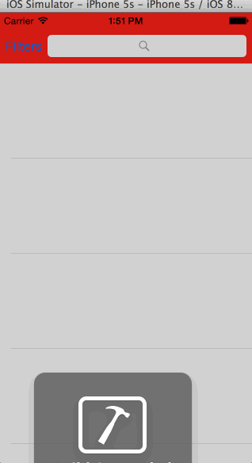

YELP
======
Yelp app developed as part of Codepath iOS Bootcamp

Time spent: approximately 8 hours

Features
---------
#### Required
Search results page
- [x] Table rows should be dynamic height according to the content height
- [x] Custom cells should have the proper Auto Layout constraints
- [x] Search bar should be in the navigation bar (doesn't have to expand to show location like the real Yelp app does).

Search results page
- [x] The filters you should actually have are: category, sort (best match, distance, highest rated), radius (meters), deals (on/off).
- [x] The filters table should be organized into sections as in the mock.
- [x] You can use the default UISwitch for on/off states. Optional: implement a custom switch
- [x] Radius filter should expand as in the real Yelp app
- [x] Clicking on the "Search" button should dismiss the filters page and trigger the search w/ the new filter settings.

Not finished yet
- [x] Categories should show a subset of the full list with a "See All" row to expand.
- [x] Adding distance filter in search

#### Optional

Video Walk thru
---------------
Video walk thru can be found here: http://imgur.com/CqU6hfZ

!(/yelp_1.gif)

